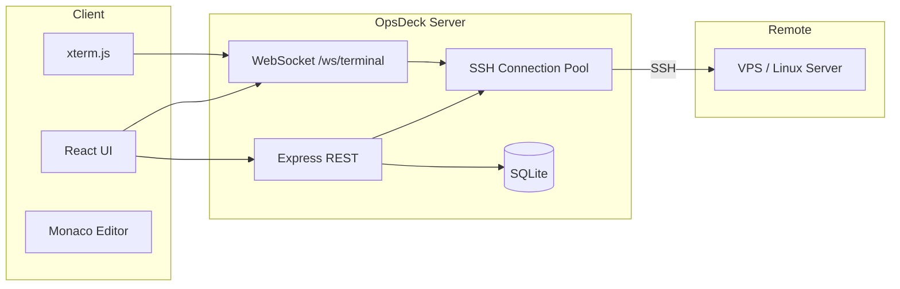

<p align="center">
  
</p>

<p align="center">
  <strong>Your mission control for remote servers.</strong><br />
  SSH terminal, file browser, saved commands, and service monitoring — in one beautiful desktop or web app.
</p>

<p align="center">
  <a href="#-installation"></a>
  <a href="#-features"></a>
  <a href="#-security"></a>
  
  
</p>

---

## Overview

**OpsDeck** is a self-hosted operations dashboard built for developers who manage VPS servers — especially [Hostinger VPS](https://www.hostinger.com/vps-hosting), DigitalOcean droplets, or any Linux box over SSH.

Instead of juggling PuTTY, WinSCP, and scattered shell scripts, OpsDeck gives you:

| Tab | What you get |
|-----|--------------|
| **Terminal** | Full interactive SSH shell with multiple tabs |
| **Files** | Grid/list explorer, bookmarks, Monaco editor, folder & Git terminals |
| **Commands** | One-click saved scripts (nginx, Docker, PM2, deploy, logs…) |
| **Services** | Live PM2, Docker, and open-port monitoring |

Run it as a **Windows desktop app** (localhost-only, safest for teams) or as a **web server** on your machine or VPS.

---

## Features

### Terminal workspace
- Multi-tab SSH sessions per VPS connection
- Auto-reconnect and connection status indicators
- Command history persisted per connection

### File browser
- List and grid views with search, filters, and sorting
- Folder bookmarks and hidden-file toggle (`.env`, dotfiles)
- In-browser file editor (Monaco) with syntax highlighting
- Per-folder SSH terminal and Git terminal drawers
- Project-aware shortcuts (Node, Docker, PM2, nginx)

### Saved commands
- Pre-loaded DevOps commands on first run
- Custom commands with categories and descriptions
- Run any saved command directly in the active terminal

### Service monitor
- PM2 process list with log tailing
- Docker container status
- Open ports and listening services

### Security built in
- Encrypted credential storage (AES via `MASTER_KEY`)
- Access-token login gate with rate limiting
- Localhost binding by default
- Path traversal and injection protections
- Security headers (CSP, X-Frame-Options, nosniff)

---

## Tech stack

| Layer | Technology |
|-------|------------|
| Frontend | React 18, Vite, Tailwind CSS, xterm.js, Monaco Editor |
| Backend | Node.js, Express, WebSocket (`ws`), ssh2 |
| Storage | SQLite (better-sqlite3) — connections & commands |
| Desktop | Electron + electron-builder (Windows NSIS installer) |

---

## Prerequisites

| Requirement | Version |
|-------------|---------|
| **Node.js** | 18 or later ([nodejs.org](https://nodejs.org)) |
| **npm** | 9+ (ships with Node) |
| **Git** | Optional — for cloning the repo |
| **SSH access** | To your target VPS (password or key) |

> **Windows desktop builds** also need build tools for `better-sqlite3` (Visual Studio Build Tools or `npm run desktop:rebuild`).

---

## Installation

### 1. Clone the repository

```bash
git clone https://github.com/Sauravkrrathaur99/opsdeck.git
cd opsdeck
```

### 2. Install dependencies

```bash
npm run setup
```

This installs root and client packages in one step.

### 3. Configure environment

Copy the example env file and edit it:

**Windows (PowerShell)**
```powershell
Copy-Item .env.example .env
notepad .env
```

**macOS / Linux**
```bash
cp .env.example .env
nano .env
```

Generate secure random secrets:

```bash
node -e "console.log(require('crypto').randomBytes(32).toString('hex'))"
```

| Variable | Required | Description |
|----------|----------|-------------|
| `PORT` | No | HTTP port (default `3847`) |
| `HOST` | No | Bind address (default `127.0.0.1`) |
| `MASTER_KEY` | Production | Encrypts stored SSH credentials (24+ chars) |
| `OPSDECK_ACCESS_TOKEN` | Network | Login password for the app (16+ chars) |

> For **local development** on `127.0.0.1`, you can leave `OPSDECK_ACCESS_TOKEN` empty — no login screen appears. Always set both secrets before exposing OpsDeck on a network.

See [`.env.example`](.env.example) for full documentation of every variable.

---

## Running OpsDeck

### Development mode (hot reload)

Starts the API server and Vite dev client concurrently:

```bash
npm run dev
```

| Service | URL |
|---------|-----|
| Web UI | http://127.0.0.1:5173 |
| API / WebSocket | http://127.0.0.1:3847 |

Open the **Vite URL** (`5173`) in your browser during development.

### Production mode (web)

Build the React client, then serve everything from Node:

```bash
npm run build
npm start
```

Open **http://127.0.0.1:3847**

### Desktop app (recommended for teams)

Run OpsDeck in its own window — binds to localhost only, no browser tab needed:

```bash
npm run desktop
```

#### Build a Windows installer

```powershell
npm run build

# Optional: embed a shared team access token in the installer
$env:OPSDECK_BUILD_TOKEN = "your-shared-access-token-here"
npm run desktop:build
```

The installer is written to `release/` (e.g. `OpsDeck Setup 1.0.0.exe`).

Share the `.exe` with teammates along with the access token (unless you embedded it at build time).

---

## First-time setup

After OpsDeck is running:

1. **Add a VPS connection** — click **+** in the sidebar
   - **Name** — e.g. `Production VPS`
   - **Host** — server IP or hostname
   - **Port** — `22`
   - **Username** — e.g. `root` or `deploy`
   - **Password** — SSH password (stored encrypted locally)

2. **Test the connection** — select it and click **Test**

3. **Explore the tabs**
   - **Terminal** — open an SSH shell
   - **Files** — browse, edit, bookmark folders
   - **Commands** — run saved DevOps scripts
   - **Services** — monitor PM2, Docker, and ports

---

## Project structure

```
opsdeck/
├── client/                 # React frontend (Vite)
│   └── src/
│       ├── App.jsx
│       └── components/     # Terminal, FileBrowser, SavedCommands, …
├── server/                 # Node.js backend
│   ├── index.js            # Entry point
│   ├── routes.js           # REST API
│   ├── terminalWs.js       # WebSocket SSH bridge
│   ├── ssh.js              # SSH connection pool
│   ├── db.js               # SQLite persistence
│   └── auth.js             # Login & session tokens
├── electron/               # Desktop app wrapper
│   ├── main.cjs
│   └── config.cjs
├── data/                   # Auto-created — local DB & state (gitignored)
├── .env.example            # Environment template
└── package.json
```

---

## Architecture



---

## NPM scripts

| Script | Description |
|--------|-------------|
| `npm run setup` | Install all dependencies |
| `npm run dev` | Development — API + Vite hot reload |
| `npm run build` | Build React client to `client/dist/` |
| `npm start` | Production server on `PORT` |
| `npm run desktop` | Build + launch Electron window |
| `npm run desktop:build` | Build Windows NSIS installer |
| `npm run desktop:rebuild` | Rebuild native modules for Electron |

---

## Deployment options

### Option A — Desktop app (safest)

Each teammate installs OpsDeck on their own PC. SSH credentials stay encrypted locally. Nothing is exposed to the internet.

### Option B — SSH tunnel (secure remote access)

Run OpsDeck on the VPS bound to localhost, then tunnel from your laptop:

```bash
ssh -L 3847:127.0.0.1:3847 deploy@YOUR_VPS_IP
```

Open http://127.0.0.1:3847 locally.

### Option C — Host on VPS (use with caution)

Only if you set strong secrets and put a reverse proxy with HTTPS + IP allowlist in front:

```bash
npm run build
scp -r . deploy@YOUR_VPS_IP:/opt/opsdeck
# On VPS:
cd /opt/opsdeck && npm run setup && npm start
```

---

## Security

OpsDeck provides **full SSH access** to your servers — terminal, file editing, and `.env` visibility. Treat it like root access.

| Protection | What it does |
|------------|--------------|
| **Access token login** | `OPSDECK_ACCESS_TOKEN` gates all API and WebSocket access |
| **Session tokens** | 8-hour signed sessions |
| **Localhost bind** | Default `HOST=127.0.0.1` — not internet-facing |
| **Production lock** | Refuses `0.0.0.0` without a valid access token |
| **Rate-limited login** | 5 failed attempts → 15-minute lockout |
| **Encrypted credentials** | SSH secrets encrypted with `MASTER_KEY` in SQLite |
| **Path validation** | Blocks `..` traversal and shell injection in paths |
| **Security headers** | CSP, X-Frame-Options DENY, nosniff |

### Checklist before going online

- [ ] Set `MASTER_KEY` (32+ random hex characters)
- [ ] Set `OPSDECK_ACCESS_TOKEN` (32+ random hex characters)
- [ ] Keep `HOST=127.0.0.1` or use an SSH tunnel
- [ ] Never commit `.env` to git
- [ ] Put nginx/Caddy with HTTPS in front if exposing a port
- [ ] Restrict access by IP allowlist

> **Never** run OpsDeck on `0.0.0.0` without `OPSDECK_ACCESS_TOKEN`.

---

## Default saved commands

OpsDeck seeds these commands on first run:

| Category | Examples |
|----------|----------|
| General | `df -h`, `free -h`, `htop`, `uptime` |
| Nginx | status, restart, error log tail |
| Docker | `docker ps -a`, container logs |
| Deploy | `pm2 status`, `pm2 restart all` |
| Logs | nginx error log tail |

Add your own deploy scripts, database backups, git pull workflows, and more from the **Commands** tab.

---

## Troubleshooting

| Problem | Fix |
|---------|-----|
| Port already in use | Change `PORT` in `.env` or stop the other process |
| `MASTER_KEY must be…` | Set a 24+ character random string in `.env` |
| SSH connection fails | Verify host, port 22, username, password; check firewall |
| Desktop app blank | Run `npm run build` first, then `npm run desktop` |
| `better-sqlite3` build error | Run `npm run desktop:rebuild` (Windows: install VS Build Tools) |
| Login loop | Clear browser storage; verify `OPSDECK_ACCESS_TOKEN` matches |

---

## Author

**Saurav Kumar Rathaur**

- GitHub: [@Sauravkrrathaur99](https://github.com/Sauravkrrathaur99)
- LinkedIn: [saurav-kumar-rathaur](https://www.linkedin.com/in/saurav-kumar-rathaur-14b3771a1/)

---

<p align="center">
  <sub>Built for developers who'd rather ship code than fight SSH clients.</sub>
</p>
